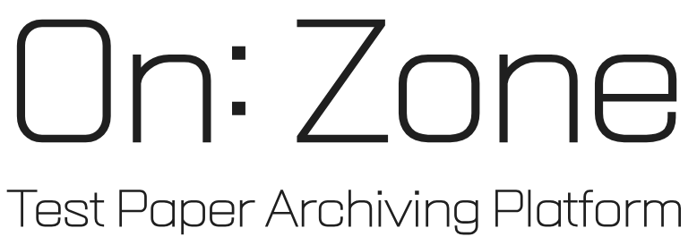
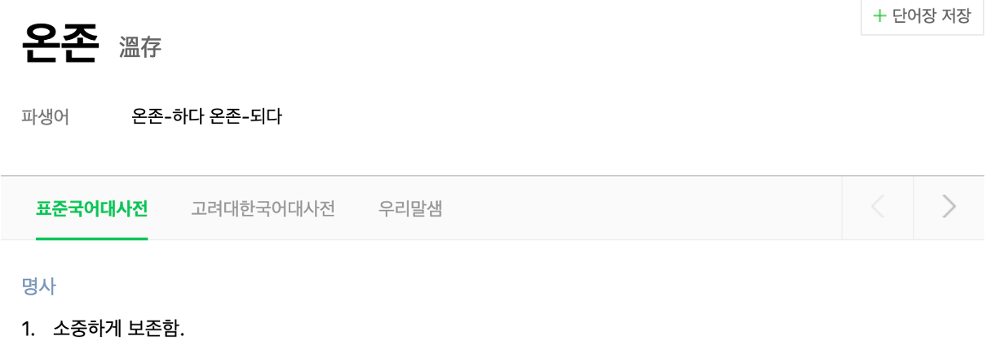

# ON: ZONE
인천과학고 시험지 아카이빙 사이트

# 왜 On: Zone인가?

**'소중하게 보존하자'** 라는 뜻이 있어 온존이라 짓게 됨.
\+ **온**라인으로 보**존**하다 라는 뜻을 내포하여 짓게 됨!

# 개발 배경
- 우리 학교(인천과학고등학교)는 **기출을 보기 매우 어려운 환경**임.
- 학교에서 기출을 제공해 주지만, **필기 및 사진 촬영 불가**.
- 학원을 다니기에는 시간, 금전적 부담이 매우 큼.

→ 따라서 이러한 문제를 해결하고자 On: Zone을 개발하게 됨!

# 개발 목표
- 시험지를 **누구나 열람 가능하도록** 함.
- **답지**를 쉽게 볼 수 있도록 함.
- 누구나 자료를 업로드할 수 있도록 함.

# 시스템 구조
## Frontend
- React.js
## Backend
- FastAPI
## Database
- SQLite3

# 전반적인 구조
